# CSU_Android_Hospital
中南大学课程设计：应用基础实践二（Web技术+数据库+移动应用开发）项目 **医院看病预约应用**

## 任务书
基本内容与要求
1. 用Android开发看病预约客户端。
2. 用JSP或PHP开发预约挂号Web服务器。
3. 用MySQL做预约挂号Web服务器的后台数据库。
4. 可以预约挂号、查看医生介绍及日程安排列表等功能。
5. 可以实现患者注册、登录功能。
6. 在线挂号支付。

## 演示动画
 

## 运行结果

#### 1、 启动页面

启动程序，进入启动页面：上面含有程序应用名称、应用logo。用户点击左上角“跳过”或等待3s自动跳过，直接进入登录页面。

 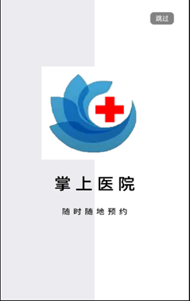

​                               

#### 2、 登录页面

之后进入登录页面：

 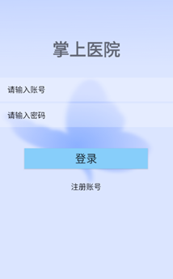

当用户输入的信息不完整时，提示“账号或密码不能为空”

 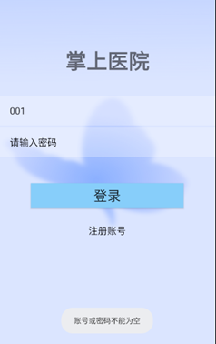

当输入的账号或密码有误时，提示信息如下：

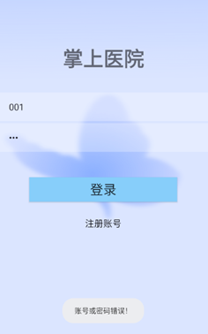

当输入信息正确时，提示信息如下，并跳转到用户首页。

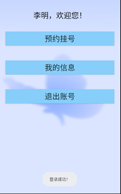

在登录页面中，点击下方的“注册账号”，可进入注册界面。

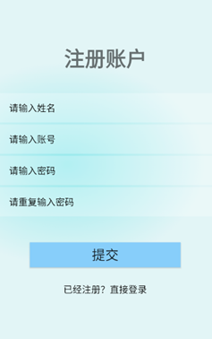

#### 3、 注册页面

用户信息输入不完整时，提示信息如下：

 

用户输入的两次密码不相同时，提示信息如下：

 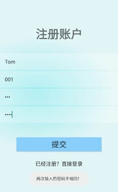

当用户输入的账号已经被注册时，提示信息如下：

 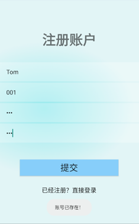

当以上情况均不存在时，注册成功，提示如下，并跳转到登录界面：

 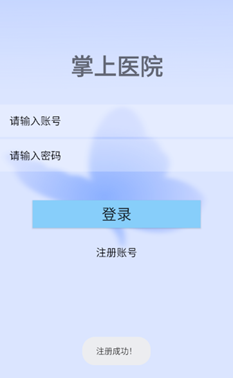

当用户已经注册过，可点击下方的“已经注册？直接登录”，直接跳转到登录界面。

#### 4、 用户首页

用户首页包含上方的简单欢迎语与下方的三个功能，点击按钮，即可实现对应的功能。

 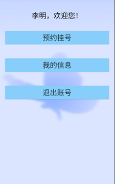

#### 5、 预约挂号

呈现所有的科室，供用户选择。

 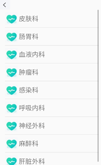

 

点击具体的科室之后，呈现该科室所有的值班医生。如下图，左边为皮肤科，右边为肠胃科：

​     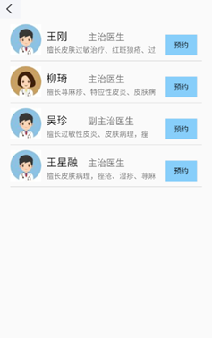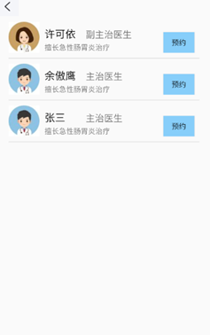

点击医生的信息，进入医生的详情介绍页：

 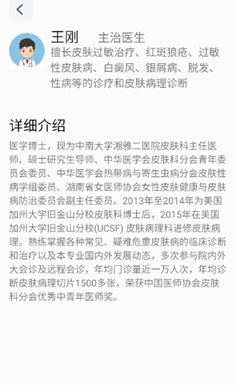

点击右边的预约按钮，查看该医生所有的排班情况：

 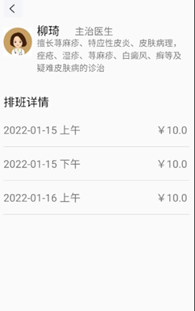

 

点击具体的某一排班，进入预约信息确认界面：

 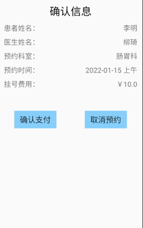

点击左边的确认支付，返回到排班信息列表，并提示支付成功：

 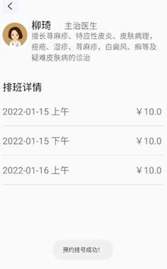

 

点击右边的取消预约按钮，退出预约界面

 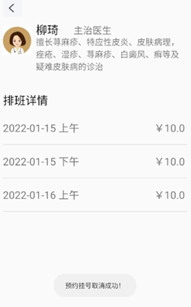

#### 6、 查看我的信息

 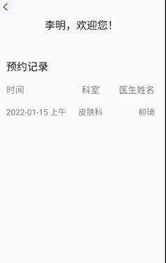

